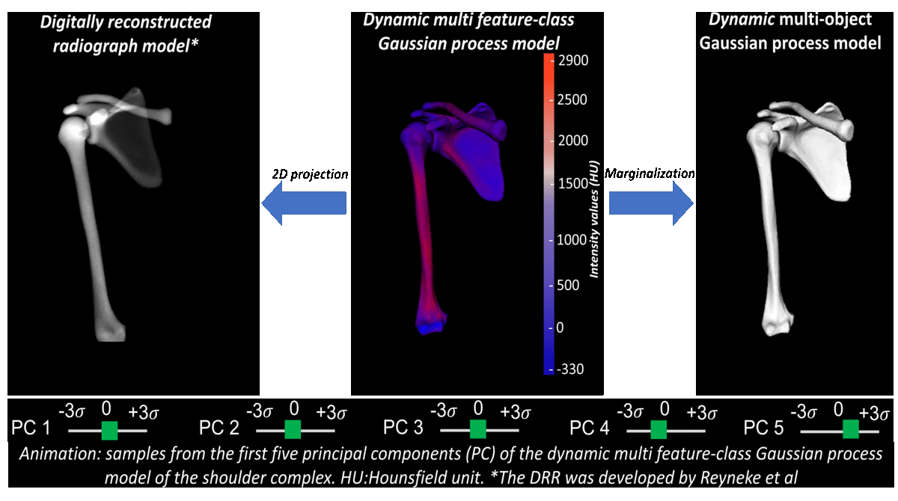

# Dynamic multi feature-class Guassian process models

This project aims to provide easy access to the framework for modelling multiple 3D rigid biological structures of interest from medical images (MRI, CT, etc.). The following tutorials explain all the basic concepts of dynamic multi-object Guassian process models (DMFC-GPM), which are necessary to develop comprehensive shape and pose modelling applications. The intention behind these tutorials is to show how to use the software as well as to help understand the theoretical concepts behind it.

Below is a demo of a shoulder model.

#### Preparation
To run the code in the tutorials, you will need to setup the latest Scalismo version. Follow the instructions in the guide:
- [Using Scalismo](https://scalismo.org/docs/)

## Tutorials
- [Tutorial 1: Installation of the software](tutorial0.md) 
- [Tutorial 2: Data structures](tutorial1.md) 
- [Tutorial 3: Shape and pose vector](tutorial2.md) 
- [Tutorial 4: Log and exponential mappings](tutorial3.md) 
- [Tutorial 5: Single shape and pose models](tutorial4.md) 
- [Tutorial 6: Multiple shape and pose models](tutorial5.md) 
